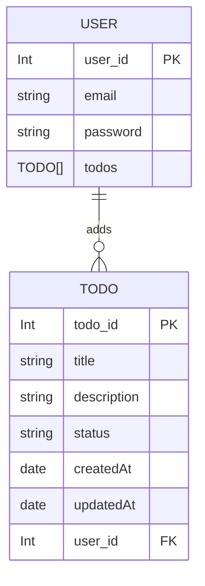

# pesto_takehome
-----------------------------------------------------------------------------------------------
----------------------------------------*NOT COMPLETE*-----------------------------------------
-----------------------------------------------------------------------------------------------
take home assignment from pesto
## DB

## Design plans
- set email in cookie to identify user, and let an __httpOnly__ set cookie be the source for authentication for now 
- if there is no set cookie, let the session belong to a *Guest* user
- on __/changeUser__ if *password* and *email* are correct, set new cookie and let the react app trigger a new __/listTodos__ api request
- __/listTodos__ should look at set cookie and return list of al todos for that user
- __/updateTodo__ should do a PUT
- __/removeTodo__ should remove 

## TODO

- [ ] add frontend part
- [ ] add tests for api
- [ ] add missing apis
- [ ] add scripts and nodemon (or any better alternative)
- [ ] ability to have multiple todo sheets for one user, once all todos in a sheet is completed, it should be marked archived
- [ ] proper authentication

